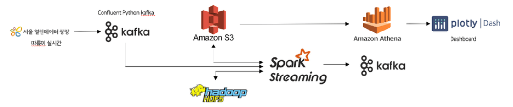

# Kafka & Spark를 활용한 실시간 Datalake 구축

AWS 클라우드 기반으로 Spark를 사용해 실시간 데이터 레이크를 구성해보는 프로젝트입니다.

---

## 📚 실시간 따릉이 데이터 플랫폼

## 1. 개요

서울시 공공자전거 '따릉이' 데이터를 Kafka와 Spark를 이용해 실시간으로 수집, 처리하고 대시보드로 시각화하는 프로젝트입니다.

## 2. 아키텍처

## 3. 핵심 구성 요소

- **`kafka-producer`**: 따릉이 데이터를 수집하여 카프카로 전송
- **`pyspark-apps`**: 카프카의 데이터를 Spark Streaming으로 실시간 처리 및 분석
- **`datalake-bicycle-dashboard`**: 분석된 최종 데이터를 대시보드로 시각화
- **`kafka-consumer`**: 데이터 모니터링을 위한 보조 컨슈머